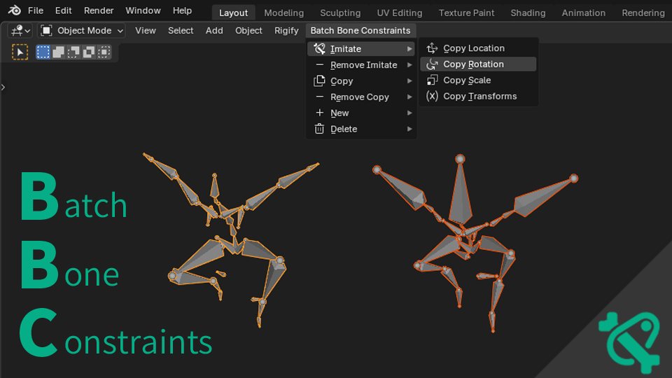

# Batch Bone Constraints

Batch bone constraints to the selected multiple armatures.

## Features

- **Six Operation Modes**:
- **Imitate**: Add constraints targeting bones with same names in active armature
- **Remove Imitate**: Remove constraints targeting bones with same names in active armature
- **Copy**: Copy constraints from bones with same names in active armature
- **Remove Copy**: Remove constraints matching those in active armature
- **New**: Add new constraints to all bones in selected armatures
- **Delete**: Remove constraints by type from all bones in selected armatures

## Quick Start

### Access Menu
- Go to **3D Viewport > Header > Batch Bone Constraints**
- Menu appears when armatures are active or selected

### Basic Usage
1. **Imitate Mode**: Select target armature (active) + other armatures → Choose constraint type
2. **Copy Mode**: Select source armature (active with constraints) + other armatures → Choose constraint type
3. **New Mode**: Select armatures → Choose constraint type to add
4. **Delete Mode**: Select armatures → Choose constraint type to remove

## Supported Constraints

### Imitate Modes (4 types)
- Copy Location, Copy Rotation, Copy Scale, Copy Transforms

### Copy/New/Delete Modes (All types)
- All Blender bone constraint types supported

## Installation

1. Open Blender > Edit > Preferences > Extensions
2. Search for "Batch Bone Constraints"
3. Click Install

## Requirements

- Blender 4.2+
- Multiple armatures with matching bone names (for Imitate/Copy modes)

## License

This addon is released under the GPL-3.0-or-later license.