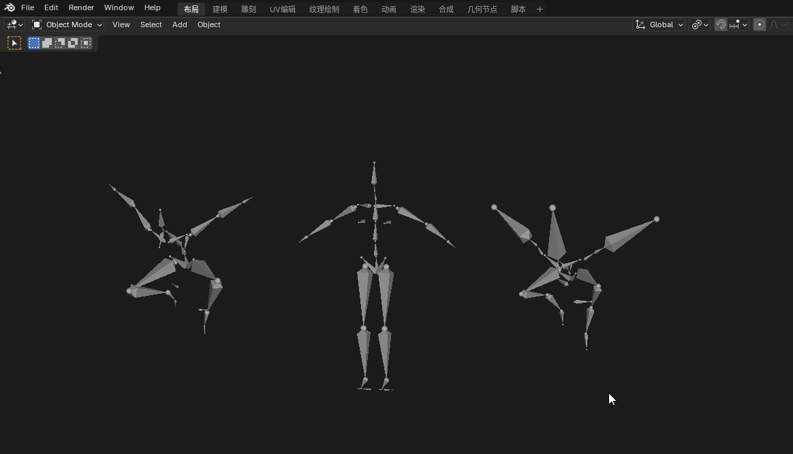

# Batch Bone Constraints

A Blender addon for batch creating and removing bone constraints between armatures with same bone names.

## Features

- **Batch Add Constraints**: Add constraints to multiple armatures at once
- **Multiple Constraint Types**: Support for Copy Location, Rotation, Scale, and Transforms constraints
- **Smart Management**: Skip existing constraints to avoid duplicates
- **Multi-language Support**: English and Chinese interface
- **Non-destructive**: Preserves existing constraints and bone transformations

## Supported Constraint Types

- Copy Location
- Copy Rotation  
- Copy Scale
- Copy Transforms

## Usage

### Basic Workflow

1. Select the **target armature** (active object with the source bones)
2. Select one or more **armatures** to add constraints to
3. Click **"Batch Bone Constraints"** menu in 3D Viewport header
4. Choose **"Batch Add Bone Constraints"**
5. Configure constraint settings in the dialog
6. Click **"Add Bone Constraints"** to apply

### Removing Constraints

- **Remove Specific Constraints**: Remove constraints pointing to active armature
- **Remove All Constraints**: Remove all constraints from selected armatures

## Installation

### Method 1: Blender Extensions Platform (Recommended)
1. Open Blender > Edit > Preferences > Extensions
2. Search for "Batch Bone Constraints"
3. Click Install

### Method 2: Manual Installation
1. Download the ZIP file
2. Open Blender > Edit > Preferences > Add-ons
3. Click "Install..." and select the ZIP file
4. Enable the addon in the Animation category

## Requirements

- Blender 3.0 or newer
- Multiple armatures with matching bone names

## Language Support

- English (default)
- 简体中文 (自动切换)

## License

This addon is released under the GPL-3.0-or-later license.